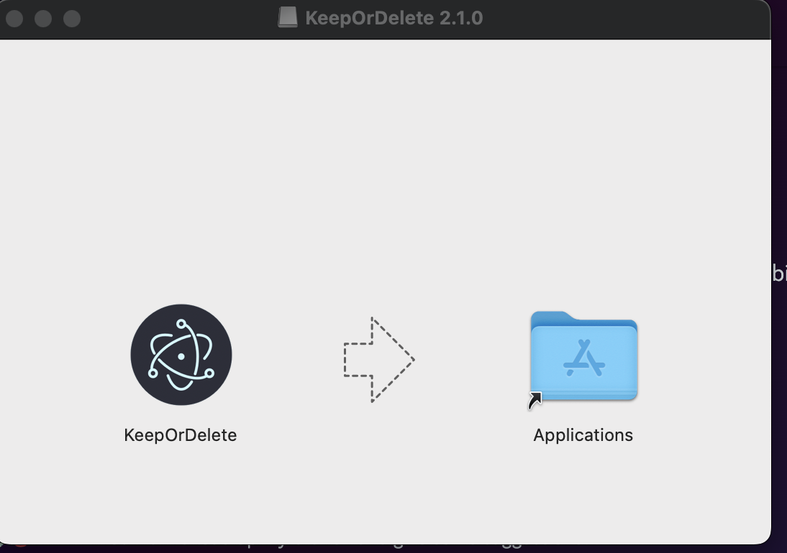
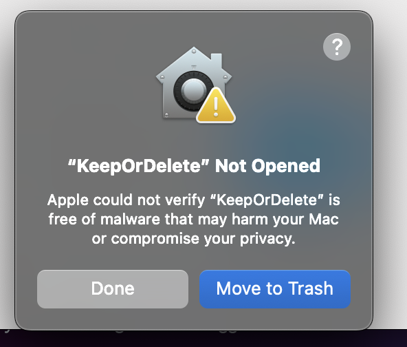
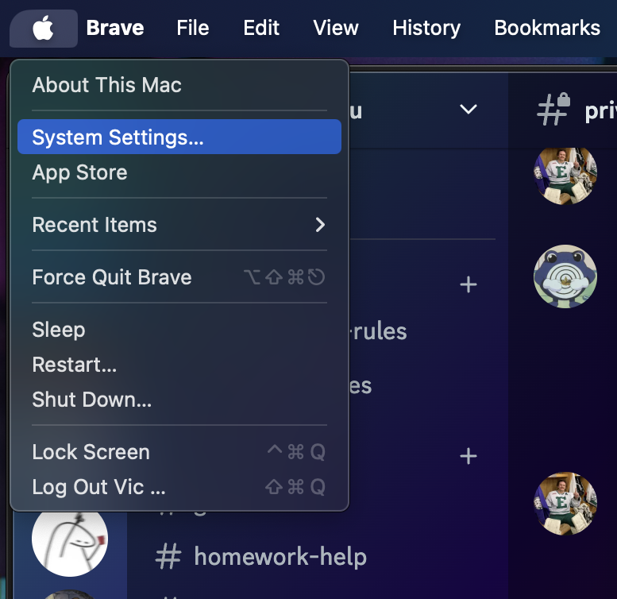
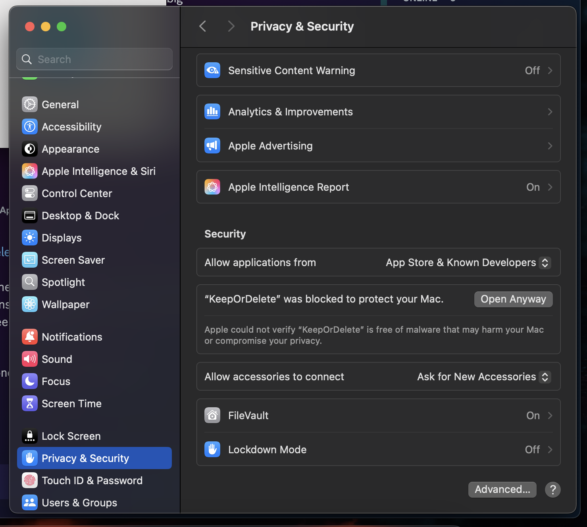

# Keep or Delete — Installation

## Install a release version (recommended)

Visit our [Releases](https://github.com/COSC481W-2025Winter/KeepOrDelete/releases) page for precompiled binaries and executables for Windows, Mac, and Linux. See below for specific instructions on your platform.

### Windows

For Windows users, we recommend downloading and running `KeepOrDelete-Setup-X.X.X.exe`.

If Windows displays a pop-up preventing the file from executing, click "More Info", then click "Run Anyway".

### Mac

For Mac users, we recommend downloading different files depending on your system architecture:

+ ARM: `KeepOrDelete-2.1.0-arm64.dmg`
+ x64: `KeepOrDelete-2.1.0.dmg`

Keep or Delete requires special system privileges in order to run on Mac.

1. After downloading, drag KeepOrDelete to Applications folder.



2. Once you click on the application there will be a popup. Click "Done".



3. Open the Apple Menu.
4. Click "System Settings".



5. In the sidebar, click "Privacy & Security".
6. Navigate to "Security", then click "Open".
7. Select "Open Anyway". Enter your password when prompted.



### Linux

For most Linux distributions, we recommend downloading the `KeepOrDelete-X.X.X.AppImage`.

Run the AppImage by making the file executable:

```bash
$ chmod +x KeepOrDelete-X.X.X.AppImage
$ ./KeepOrDelete-X.X.X.AppImage
```

#### NixOS

For NixOS users, we recommend downloading the generic Linux AppImage and running it using the following commands:

```bash
$ nix-shell -p appimage-run
$ appimage-run KeepOrDelete-X.X.X.AppImage
```

## Install from source

<!-- inspo from https://github.com/neovim/neovim/blob/master/INSTALL.md#install-from-source -->

> [!WARNING]
> For non-developers, we recommend [installing via GitHub Releases](#install-a-release-version-recommended).

Prerequisites:

+ [Git](https://git-scm.com)
+ [npm](https://www.npmjs.com/)

Clone this repo using Git.

```bash
$ git clone https://github.com/COSC481W-2025Winter/KeepOrDelete
```

Install project dependencies:

```bash
$ cd KeepOrDelete
$ npm install
```

Run the application:

```bash
$ npm start
```

### NixOS

If you are on NixOS and receive the following error:

```
/home/user/KeepOrDelete/node_modules/electron/dist/electron: error while loading shared libraries: libglib-2.0.so.0: cannot open shared object file: No such file or directory
```

Replace the Electron binary at `node_modules/electron/dist/electron` with a soft link to one installed via Nix (wherever that may be on your system):

```bash
$ rm node_modules/electron/dist/electron
$ ln -s /run/current-system/sw/bin/electron node_modules/electron/dist/electron
```
